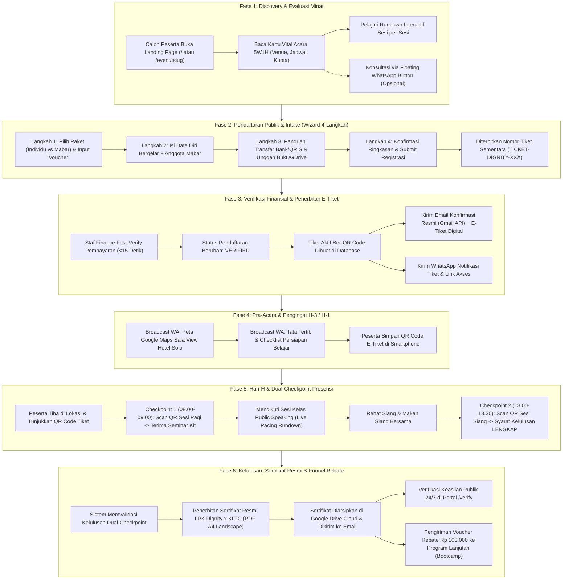

# 📄 PRD: END-TO-END CUSTOMER JOURNEY & USER LIFECYCLE FLOW
## Panduan Komprehensif Alur Pengguna Calon Peserta: Dari Penemuan Acara, Pendaftaran, Bukti Bayar GDrive, Presensi Hari-H, hingga Penerbitan Sertifikat Resmi & Funnel Retensi
### Dignity Event Operations & Public Speaking Command Center

---

## 1. Ringkasan Eksekutif & Filosofi Pengalaman Pengguna (Customer-Centric)

### 1.1 Latar Belakang & Tujuan Dokumen
Dokumen Spesifikasi Kebutuhan Produk (PRD) ini merumuskan **arsitektur alur pengguna (*User Flow & Customer Journey*)** secara utuh dan terpadu dari sudut pandang **pelanggan / calon peserta (*trainee perspective*)** yang ingin mendaftar dan mengikuti program pelatihan *Public Speaking* (baik Webinar Online maupun Bootcamp Tatap Muka di Sala View Hotel Solo).

Dokumen ini menjembatani seluruh modul yang telah diimplementasikan (PRD 01 s/d PRD 17), memastikan tidak ada mata rantai pengalaman peserta yang terputus sejak pertama kali melihat informasi pelatihan hingga menerima sertifikat kompetensi resmi berstandar nasional dan voucher diskon program lanjutan.

### 1.2 Persona Pengguna (Customer Archetypes)
Platform pendaftaran dan operasional Dignity dirancang inklusif untuk melayani 3 arketipe peserta utama:
1. **Persona A — "The Aspiring Youth" (Mahasiswa & Fresh Graduate, Usia 19–24 Tahun):**
   - *Motivasi:* Ingin mengatasi grogi saat presentasi sidang skripsi atau wawancara kerja, mencari sertifikat berbobot portofolio dengan harga terjangkau (mencari diskon/paket Mabar).
   - *Kebiasaan:* Mengakses web via ponsel (*mobile-first*), menyukai pembayaran instan (QRIS / m-Banking), terbiasa menyimpan berkas bukti di Google Drive atau tangkapan layar (screenshot).
2. **Persona B — "The Mid-Career Professional" (Karyawan, Supervisor, Sales/Marketing, Usia 25–40 Tahun):**
   - *Motivasi:* Membutuhkan keterampilan berbicara persuasif di hadapan klien, rapat direksi, atau memimpin tim.
   - *Kebiasaan:* Mengutamakan jadwal yang pasti (rundown menit-ke-menit), membutuhkan invoice/tanda terima resmi untuk klaim *reimbursement* kantor, dan meminta E-Tiket ber-QR untuk kemudahan registrasi ulang.
3. **Persona C — "The Silver Executive" (Pejabat Instansi, Dosen Senior, Tenaga Medis/Dokter, Usia 45–55+ Tahun):**
   - *Motivasi:* Menjaga wibawa saat berpidato di acara resmi, seminar nasional, atau forum publik.
   - *Kebiasaan:* Membaca di layar smartphone dengan kacamata baca, membutuhkan kontras tinggi dan teks besar (standar ramah usia 50+ / PRD 17), sangat mengapresiasi kejelasan lokasi fisik (Google Maps), serta menginginkan tombol kontak WhatsApp panitia yang mudah diakses jika memerlukan panduan pendaftaran.

---

## 2. Analisis & Standar Tata Kelola Keamanan Tautan Google Drive Pendaftar

Salah satu pertanyaan kritis dalam proses penerimaan pendaftar baru adalah:
> **"Apakah tautan Google Drive aman jika dimasukkan oleh pendaftar saat melampirkan bukti pembayaran?"**

### 2.1 Evaluasi Lapisan Keamanan (Multi-Layer Security Audit)

| Lapisan Keamanan | Mekanisme Perlindungan di Sistem Dignity | Status & Hasil Audit |
| :--- | :--- | :---: |
| **Proteksi Privasi Pendaftar (Anti-Scraping / Kerahasiaan)** | Tautan Google Drive pendaftar disimpan pada kolom `proof_drive_file_id` (tabel `registrations` dan `payments`). Akses tabel dilindungi oleh kebijakan ketat **Row Level Security (RLS)** Supabase. Pihak anonim atau peserta lain **sama sekali tidak dapat men-scrape, mengintip, atau membaca bukti pembayaran** milik orang lain. | 🛡️ **SANGAT AMAN** |
| **Isolasi Akses Operator** | Bukti bayar hanya dapat dilihat oleh staf admin/finance yang telah login secara sah di portal Command Center (`AdminLoginGate.jsx` & `FastVerifyModal.jsx`). | 🛡️ **SANGAT AMAN** |
| **Mitigasi Serangan Formula Injection** | Jika tautan bukti bayar diekspor ke format CSV laporan keuangan, helper `csvRundownHelper.js` telah dilengkapi sanitasi berspesifikasi OWASP (`sanitizeCsvFormula`) untuk mencegah eksekusi formula DDE berbahaya di Microsoft Excel. | 🛡️ **SANGAT AMAN** |

### 2.2 Tantangan Teknis Operasional & Prosedur Mitigasi (Operational Hazard)
Meskipun database aman dari kebocoran, terdapat potensi kendala operasional dari sisi perilaku peserta (*user behavior*):
- **Risiko Berkas Tertutup (*Restricted / Private Access*):** Jika peserta menyalin tautan Google Drive pribadi tanpa mengubah hak akses menjadi *"Anyone with the link can view"* (Siapa saja yang memiliki link dapat melihat), staf finance yang memverifikasi pembayaran tidak akan bisa membuka gambar secara langsung di modal verifikasi.
- **Standar Solusi & Prosedur Sistem yang Diterapkan:**
  1. **Opsi Utama UPLOAD Langsung:** Sistem memprioritaskan opsi **"Unggah File Gambar Langsung (JPG/PNG maks 5MB)"** pada tab formulir. Berkas yang diunggah langsung diproses menjadi *Base64 Data URL* atau disimpan ke Supabase Storage, sehingga 100% instan dan tidak bergantung pada izin Google Drive.
  2. **Panduan Visual Khusus Tab GDRIVE:** Pada tab Google Drive, formulir pendaftaran wajib menampilkan panduan peringatan ramah pengguna:
     > *"Pastikan tautan berkas di Google Drive Anda telah disetel ke **'Siapa saja yang memiliki link dapat melihat' (Anyone with the link can view)** agar bukti pembayaran dapat diverifikasi langsung oleh panitia dalam waktu <15 detik."*
  3. **Tautan Cadangan Manual di Modal Finance:** Apabila thumbnail preview Google Drive gagal dimuat otomatis karena pembatasan API Google, antarmuka `ProofModal.jsx` menyediakan tombol darurat: `[Buka Tautan Google Drive di Tab Baru]` sehingga operator dapat langsung memeriksa bukti bayar peserta.

---

## 3. Peta Alur Perjalanan Pengguna (The 6-Stage End-to-End Customer Lifecycle)

Berikut adalah visualisasi alur komprehensif dari titik kontak pertama hingga pasca acara:



---

## 4. Spesifikasi Rinci Setiap Tahapan Perjalanan Peserta

### 4.1 Fase 1: Discovery & Evaluasi Minat (*Pre-Registration Stage*)
* **Titik Masuk Pengguna:** Calon peserta mengakses tautan URL publik (misal: dari promosi Instagram, broadcast WhatsApp grup, atau iklan brosur).
* **Rute URL:** `/` atau `/event/:slug` (Komponen: `DynamicEventLandingPage.jsx`).
* **Pengalaman Antarmuka (UX Touchpoints):**
  1. **Desain Bersih & Elegan (Senior-Friendly UI/UX - PRD 17):**
     - Latar belakang cerah *Royal Navy & Pure White* yang nyaman dibaca tanpa silau.
     - Tipografi besar (judul 28–36px, isi 16–18px) yang mudah dibaca peserta usia 45–55+ tahun tanpa kacamata pembesar.
  2. **Kartu Ringkasan Vital Acara 5W1H (`EventVitalCard.jsx`):**
     - **What:** Pelatihan Public Speaking & Komunikasi Efektif.
     - **Who:** Trainer bersertifikasi (Willy Tan & Mbak Diyah).
     - **When:** Hari, tanggal, dan rentang jam pelaksanaan.
     - **Where:** Sala View Hotel Solo, lengkap dengan tautan navigasi langsung ke aplikasi Google Maps.
     - **Seat Availability:** Indikator visual sisa kuota kursi yang dinamis dan terhubung ke database.
  3. **Showcase Rundown Interaktif (`PublicRundownShowcase.jsx`):**
     - Peserta dapat mengeklik tab hari (Hari 1, Hari 2) untuk meninjau jam pelaksanaan per topik (Teori Olah Vokal, Bahasa Tubuh, Praktik Panggung, Tanya Jawab, hingga Sesi Foto Bersama).
  4. **Jalur Bantuan Ramah (*Floating WhatsApp Button*):**
     - Tombol hijau WhatsApp mengapung di pojok kanan bawah dengan template teks otomatis: *"Halo Panitia Dignity, saya ingin bertanya seputar pendaftaran pelatihan..."*

---

### 4.2 Fase 2: Pendaftaran Publik 4 Langkah (*Registration & Intake Engine*)
* **Rute URL:** `/register/:slug` (Komponen: `PublicRegistrationWizard.jsx`).
* **Prinsip UX:** Alur langkah demi langkah (*stepper wizard*) yang mencegah beban kognitif berlebih (*cognitive overload*).
* **Rincian 4 Langkah Pendaftaran:**
  1. **Langkah 1: Paket Pelatihan & Voucher:**
     - Peserta memilih jenis paket:
       - **Paket Individu:** Investasi perorangan standar.
       - **Paket Mabar (Klaster Rombongan):** Pendaftaran grup 5–10 orang dengan potongan harga khusus (PRD 06).
     - Kolom Input Voucher Diskon: Jika peserta memiliki kode voucher rebate (misal alumni webinar sebelumnya), sistem memverifikasi kode secara real-time via RPC `claim_voucher_rebate` (PRD 10) dengan proteksi anti-double spend.
  2. **Langkah 2: Data Diri Peserta & Anggota:**
     - **Nama Lengkap & Gelar:** Diberi catatan penting: *"Nama ini yang akan dicetak pada Sertifikat Resmi berstandar LPK Dignity x KLTC®."*
     - **Nomor WhatsApp Aktif:** Untuk pengiriman E-Tiket dan undangan grup peserta.
     - **Alamat Email:** Untuk pengiriman berkas invoice, tiket PDF, dan sertifikat digital.
     - **Instansi / Perusahaan & Jabatan:** Untuk pencatatan data registrasi profesi.
     - **Domisili Kota:** Pemetaan asal peserta.
     - *Jika Paket Mabar:* Muncul form dinamis untuk mengisi nama dan nomor kontak seluruh anggota tim (Sub-tiket -A s/d -F).
  3. **Langkah 3: Pembayaran & Bukti Transfer:**
     - Menampilkan instruksi transfer bank resmi (BCA, Mandiri, atau QRIS) yang dikelola dinamis melalui Master Config (PRD 14).
     - **Metode Pelampiran Bukti Bayar:**
       - **Tab 1 — Upload Gambar Langsung (Rekomendasi):** Mengunggah foto struk transfer/screenshot m-banking dari galeri HP (JPG, PNG, PDF maks 5MB) dengan tinjauan langsung (*image preview*).
       - **Tab 2 — Tautan Google Drive:** Menempelkan tautan Google Drive dengan instruksi wajib menyetel hak akses ke *"Anyone with the link can view"*.
  4. **Langkah 4: Konfirmasi & Penerbitan Nomor Tiket:**
     - Menampilkan ringkasan data sebelum dikirim.
     - Setelah tombol **[Kirim Pendaftaran]** diklik, sistem memanggil stored procedure `submit_web_registration`.
     - Muncul layar sukses yang menampilkan:
       - **Nomor Registrasi Unik:** Contoh `TICKET-DIGNITY-742`.
       - Status awal: `PENDING_VERIFICATION`.
       - Tombol unduh bukti ringkasan dan tautan instan untuk mengonfirmasi ke WhatsApp panitia.

---

### 4.3 Fase 3: Verifikasi Finansial & Penerbitan E-Tiket (*Ticketing Delivery*)
* **Aktor Pengelola:** Staf Finance & Admin Command Center.
* **Komponen Teknis:** `FastVerifyModal.jsx`, `paymentService.js`, `ticketService.js`, `communicationService.js`.
* **Alur Kerja Finansial:**
  1. Pendaftaran baru otomatis masuk ke antrean verifikasi di tab Pembayaran.
  2. Staf finance membuka `FastVerifyModal.jsx` (<15 detik per transaksi) untuk mencocokkan mutasi kas masuk di rekening bank dengan gambar bukti transfer yang dilampirkan.
  3. **Aksi Verifikasi:**
     - **Jika Valid:** Klik **[Verifikasi & Terbitkan Tiket]**.
       - Status pendaftaran berubah menjadi `VERIFIED`.
       - Sistem membuat record tiket aktif di tabel `tickets` dengan QR Code *payload* berbasis enkripsi/token UUID unik.
     - **Jika Tidak Valid / Kurang Bayar:** Klik **[Tolak Pembayaran]** dengan memilih alasan (Nominal tidak sesuai, mutasi tidak ditemukan, bukti buram/palsu). Sistem mencatat alasan penolakan dan mengirimkan notifikasi revisi ke peserta.
  4. **Pengiriman E-Tiket ke Peserta:**
     - **Email Resmi (Gmail API OAuth - PRD 08):** Peserta menerima email berdesain elegan berisi tiket digital, invoice tanda terima, barcode/QR Code presensi, peta lokasi hotel, dan kontak darurat panitia.
     - **WhatsApp Notifikasi:** Peserta menerima pesan WhatsApp personal berisi ringkasan tiket dan tautan cepat untuk membuka tiket digital di browser (`#/ticket/:code`).

---

### 4.4 Fase 4: Pra-Acara & Pengingat H-3 / H-1 (*Pre-Event Engagement*)
* **Tujuan:** Menjaga antusiasme peserta, meminimalkan ketidakhadiran (*no-show rate*), dan memastikan kelancaran logistik peserta dari luar kota.
* **Aktivitas Komunikasi (Communication Center - PRD 08):**
  - **Broadcast H-3:** Panduan akomodasi sekitar Sala View Hotel Solo, panduan pakaian (dress code: *smart casual* / batik rapi), dan tautan grup WhatsApp interaktif.
  - **Broadcast H-1:** Pengingat membawa identitas diri dan menyiapkan QR Code tiket di layar smartphone agar proses presensi di meja registrasi berlangsung cepat tanpa antrean.

---

### 4.5 Fase 5: Hari-H Pelatihan & Presensi Ganda (*Dual-Checkpoint Attendance*)
* **Lokasi Pelaksanaan:** Ballroom Sala View Hotel Solo.
* **Komponen Operasional:** `AttendanceView.jsx`, `PublicAttendanceForm.jsx`, `RundownStageView.jsx`.
* **Alur Pelaksanaan Presensi Ganda (Dual-Checkpoint):**
  1. **Kedatangan & Checkpoint Sesi Pagi (08.00–09.00 WIB):**
     - Peserta tiba di lobi ballroom dan menunjukkan QR Code tiket pada petugas meja registrasi.
     - Petugas memindai QR menggunakan scanner kamera mobile atau melakukan pencarian cepat nama di antarmuka `AttendanceView.jsx`.
     - **Tindakan Sistem:** Record absensi dibuat pada tabel `attendances` dengan flag `session_1_checked_in = true` beserta *timestamp* presensi pagi.
     - **Hak Peserta:** Peserta menerima *seminar kit* eksklusif, name tag tanda pengenal, materi modul pelatihan, dan kupon *morning coffee break*.
  2. **Pelaksanaan Sesi Belajar & Praktik Berbicara (09.00–12.00 WIB):**
     - Trainer memandu materi *Public Speaking Mastery*, olah vokal, dan bahasa tubuh.
     - Alur waktu sesi dipandu secara presisi oleh operator panggung menggunakan *Interactive Stage Rundown & Teleprompter* (PRD 16).
  3. **Istirahat & Makan Siang (12.00–13.00 WIB):**
     - Peserta menikmati makan siang prasmanan di resto hotel.
  4. **Checkpoint Sesi Siang & Simulasi Panggung (13.00–13.30 WIB):**
     - Peserta memasuki kembali ruangan untuk sesi simulasi praktik panggung langsung di depan audiens.
     - Petugas melakukan pemindaian kedua (Checkpoint Siang) pada pintu masuk ruangan.
     - **Tindakan Sistem:** Kolom `session_2_checked_in = true` diaktifkan.
     - **Penetapan Syarat Kelulusan:** Sistem menandai status presensi peserta menjadi `COMPLETED_FULL` (Hadir Sesi 1 & Sesi 2). Status ini menjadi **kunci pembuka mutlak (*prerequisite*)** bagi sistem untuk menerbitkan sertifikat resmi.

---

### 4.6 Fase 6: Kelulusan, Sertifikat Resmi, Verifikasi Publik & Retensi (*Post-Event*)
* **Komponen Teknis:** `certificateService.js`, `CertificatesView.jsx`, `CertificateVerification.jsx`, `VoucherManagementView.jsx`.
* **Alur Penerbitan & Verifikasi Sertifikat:**
  1. **Penerbitan Sertifikat Resmi Otomatis (PRD 09):**
     - Operator meninjau daftar peserta yang telah menyelesaikan presensi ganda di `CertificatesView.jsx`.
     - Operator mengeklik tombol **[Generate All Certificates]**.
     - Sistem memproses penomoran resmi berstandar nasional **LPK Indonesia Dignity x KLTC®** (format: `LPK-DIG/PUB-SPK/YYYY/NOMOR_URUT`).
     - Dokumen PDF A4 Landscape diterbitkan lengkap dengan nama bergelar peserta, QR Code verifikasi unik, tanda tangan digital Direktur LPK Dignity dan Master Trainer, serta daftar kompetensi yang dikuasai pada lembar transkrip nilai belakang.
  2. **Pengarsipan Google Drive & Pengiriman ke Peserta:**
     - Berkas PDF sertifikat diunggah otomatis ke folder Google Drive Cloud panitia untuk arsip permanen.
     - Tautan unduh sertifikat beresolusi tinggi dikirimkan langsung ke email masing-masing peserta bersama dokumentasi foto acara.
  3. **Portal Verifikasi Publik 24/7 (`/verify`):**
     - Setiap sertifikat dilengkapi kode unik atau QR Code.
     - Peserta, HRD tempat peserta bekerja, instansi pemerintah, atau perguruan tinggi dapat membuka portal publik `/verify` (`CertificateVerification.jsx`) kapan saja.
     - Menggunakan stored procedure aman `verify_certificate_public(p_code)` (bebas risiko kebocoran data pribadi / anti-scraping), portal akan menampilkan keaslian sertifikat: *Nama Penerima, Judul Pelatihan, Tanggal Lulus, Penyelenggara Resmi, dan Status Keabsahan*.
  4. **Retensi Pasca Acara & Voucher Funnel (PRD 10 & PRD 03):**
     - Sistem mengirimkan email apresiasi kelulusan dan secara otomatis menyertakan **Kode Voucher Rebate Rp 100.000**.
     - Voucher ini dapat digunakan peserta atau rekannya untuk mendaftar ke jenjang pelatihan berikutnya (misal: *Bootcamp Intensif Public Speaking & MC Protokoler 2 Hari Tatap Muka*).
     - Tim penjualan dapat melacak tingkat konversi alumni di *Business Intelligence & Conversion Tracker* (`ConversionView.jsx`).

---

## 5. Matriks Penanganan Kondisi Khusus & Pengecualian (Edge Cases & Fallbacks)

| Skenario Khusus / Kendala | Dampak pada Peserta | Prosedur Solusi Sistem Dignity |
| :--- | :--- | :--- |
| **Tautan Google Drive Peserta Berstatus "Access Denied"** | Admin finance tidak dapat melihat gambar bukti transfer di modal verifikasi. | 1. Modal verifikasi menampilkan pesan instruksi: *"Tautan Drive terproteksi/private."*<br>2. Tombol satu-klik `[Hubungi Peserta via WhatsApp]` tersedia untuk meminta peserta membuka izin berkas atau mengirim ulang bukti via chat WA.<br>3. Admin dapat mengunggah bukti pengganti secara manual di drawer detail peserta. |
| **Peserta Salah Mengetik Nama/Gelar saat Pendaftaran** | Nama pada E-Tiket atau draf sertifikat salah eja. | 1. Peserta dapat melapor ke panitia meja registrasi pada Hari-H.<br>2. Operator dapat langsung memperbarui nama bergelar di `ParticipantDetailDrawer.jsx` sebelum sertifikat digenerate.<br>3. Jika sertifikat sudah terbit, sistem memiliki fitur *Regenerate Certificate* yang secara otomatis memperbarui berkas PDF dan data verifikasi di portal `/verify`. |
| **Peserta Hanya Hadir Sesi Pagi (Bolos Sesi Siang)** | Peserta tidak memenuhi syarat kehadiran minimum dual-checkpoint. | 1. Sistem mendeteksi `session_1 = true` namun `session_2 = false`.<br>2. Tombol penerbitan sertifikat untuk peserta tersebut berstatus terkunci (*Locked - Attendance Incomplete*).<br>3. Panitia dapat memberikan toleransi manual (*manual override*) hanya jika ada izin resmi/dispensasi yang diverifikasi oleh penanggung jawab acara. |
| **Kuota Tiket Habis saat Peserta Sedang Mengisi Form** | Peserta gagal submit di langkah terakhir karena kuota penuh. | 1. Sistem memeriksa sisa kuota secara *real-time* sebelum komit database.<br>2. Jika kuota habis, muncul modal notifikasi santun: *"Mohon maaf, kuota kursi baru saja terpenuhi."*<br>3. Sistem menawarkan opsi masuk ke **Daftar Tunggu (*Waiting List*)** atau dialihkan ke gelombang pelatihan berikutnya dengan prioritas kursi utama. |
| **Pendaftaran Rombongan (Mabar) Mengalami Pergantian Anggota** | Salah satu anggota grup berhalangan hadir pada Hari-H. | 1. Pemilik tiket mabar atau admin dapat mengedit sub-tiket anggota tim di `RegistrationMembersModal.jsx`.<br>2. Nama anggota baru langsung terdaftar dan dapat dipindai QR tiketnya pada saat presensi. |

---

## 6. Pemetaan Komponen Kode & Skema Basis Data

```text
Alur Pelanggan (Customer Lifecycle)
├── 1. Discovery & Evaluasi
│   ├── UI: /src/features/landing/DynamicEventLandingPage.jsx
│   ├── Komponen 5W1H: /src/features/landing/EventVitalCard.jsx
│   ├── Showcase Rundown: /src/features/landing/PublicRundownShowcase.jsx
│   └── Bantuan WA: /src/features/landing/FloatingWhatsAppButton.jsx
│
├── 2. Intake Pendaftaran 4-Step
│   ├── UI Wizard: /src/features/public_registration/PublicRegistrationWizard.jsx
│   ├── RPC Database: submit_web_registration()
│   └── Layanan: /src/services/registrationService.js
│
├── 3. Verifikasi & Pengiriman E-Tiket
│   ├── Modal Verifikasi: /src/features/payments/FastVerifyModal.jsx, ProofModal.jsx
│   ├── Komunikasi Gmail: /src/services/googleApiService.js, communicationService.js
│   └── Modul Tiket: /src/features/tickets/TicketPreviewModal.jsx, TicketsView.jsx
│
├── 4. Hari-H & Dual-Checkpoint Presensi
│   ├── Scanner & List Presensi: /src/features/registrations/AttendanceView.jsx
│   ├── Form Presensi Mandiri: /src/features/public_registration/PublicAttendanceForm.jsx
│   └── Kendali Panggung Live: /src/features/rundown/RundownStageView.jsx
│
├── 5. Kelulusan, Sertifikat & Verifikasi Publik
│   ├── Generator Sertifikat: /src/services/certificateService.js, CertificatesView.jsx
│   ├── Portal Verifikasi Publik: /src/features/verify/CertificateVerification.jsx
│   └── RPC Publik Aman: verify_certificate_public(p_code)
│
└── 6. Retensi Pasca Acara & Voucher Funnel
    ├── Manajemen Voucher: /src/features/vouchers/VoucherManagementView.jsx
    ├── Pelacak Konversi: /src/features/business/ConversionView.jsx
    └── Arsitektur Funnel: /src/features/events/EventsPortfolioView.jsx
```

---

## 7. Rangkuman & Rekomendasi Tindak Lanjut

Dengan disahkannya PRD Customer Journey ini:
1. **Keamanan Google Drive:** Sistem dinyatakan aman dari kebocoran data pendaftar (terisolasi RLS Supabase dan sanitasi CSV). Panduan visual izin berkas *"Anyone with the link can view"* menjadi standar operasional pada formulir pendaftaran.
2. **Kelengkapan Siklus Pengguna:** Calon peserta dijamin mendapatkan pengalaman yang mulus, transparan, dan terpercaya mulai dari landing page ramah lansia/50+, pendaftaran 4-langkah, verifikasi kas kilat, presensi ganda Hari-H, hingga perolehan sertifikat resmi LPK Dignity x KLTC® yang dapat diverifikasi siapa saja secara terbuka di portal `/verify`.
